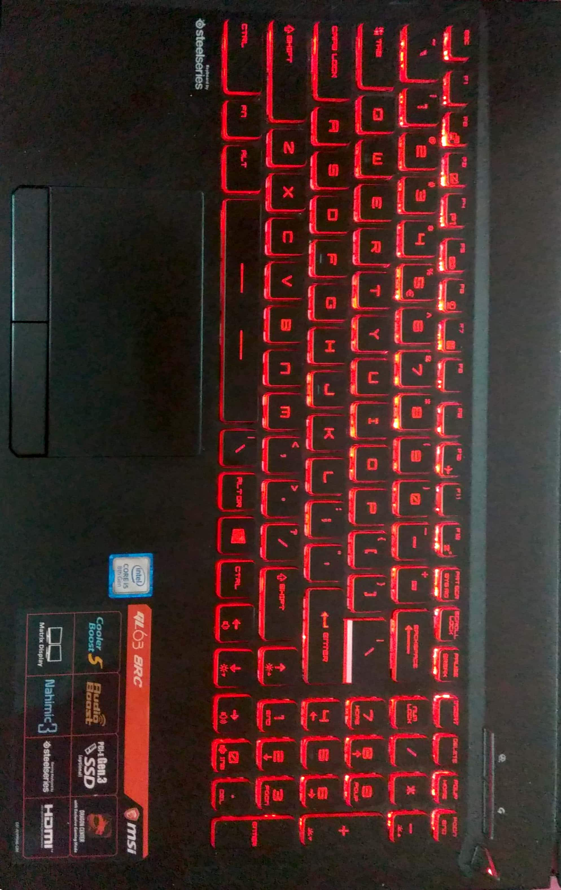
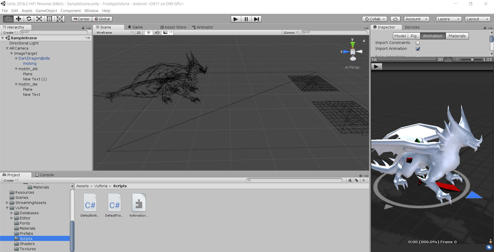

# FirstAppVuforia
Getting Started with Augmented Reality - Unity/Vuforia

* This is my first Augmented Reality based mobile application. 
* Build on Unity-3d for multi-platforms( I've build apk for Android )
>[Download here](https://github.com/mmudit30/FirstAppVuforia/raw/master/model_demo2.apk)
You will need a Target Image to get the model work upon.
Here I've used my laptop as a target image 

* I used Vuforia [Vuforia is an augmented reality software development kit](https://www.vuforia.com/).
* Used Virtual Buttons and Event handlers using C#. 
* DarkDragon Asset downloaded which is freely available at unity asset store. 
* Buttons are 'attack' and 'die'.
When you hover over the buttons, animation event is handled and acted on the dragon.
[Watch Demo here](https://youtu.be/-EhUBNIHVhs) 

